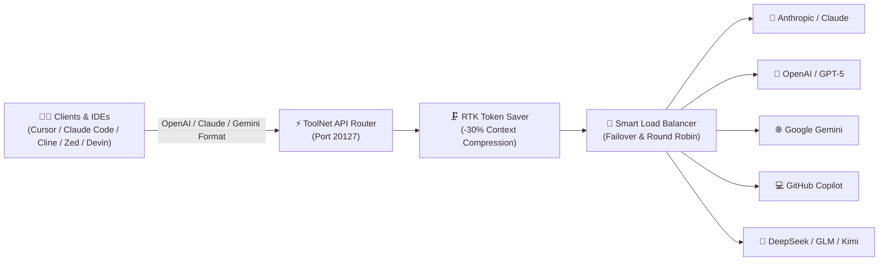

<div align="center">
  
  
  # 🚀 ToolNet API

  **Universal AI Gateway, Smart Load Balancer & Token Optimizer for Developers & Coding Assistants**

  [](https://github.com/LBT-AI/toolnetapi/stargazers)
  [](https://github.com/LBT-AI/toolnetapi/network/members)
  [](https://github.com/LBT-AI/toolnetapi/actions)
  [](https://github.com/LBT-AI/toolnetapi/pkgs/container/toolnetapi)
  [](https://github.com/LBT-AI/toolnetapi/blob/main/LICENSE)

  [English](#-english-overview) • [Tiếng Việt](#-tổng-quan-tiếng-việt) • [Quick Start](#-quick-start) • [Features](#-key-features) • [CLI Tool](#-built-in-agentic-cli) • [Docker](#-docker-deployment) • [Configuration](#-configuration)
</div>

---

## 🌟 English Overview

**ToolNet API** is an enterprise-grade, high-performance universal AI middleware and proxy router designed to connect modern AI coding assistants (Claude Code, Cursor, Cline, OpenCode, Windsurf, Trae, Devin, Zed) to all major LLM providers (OpenAI, Anthropic, Google Gemini, GitHub Copilot, DeepSeek, GLM, MiniMax, Kimi, etc.).

By functioning as a local or self-hosted intelligent gateway, **ToolNet API** provides automated token compression (saving 20–40% on prompt costs), multi-account load balancing with zero-downtime failover, protocol transformation (OpenAI ↔ Claude ↔ Gemini ↔ Codex), and transparent MITM traffic capture.

---

## 🇻🇳 Tổng quan (Tiếng Việt)

**ToolNet API** là nền tảng AI Gateway & Proxy Router trung gian hiệu năng cao, cho phép kết nối toàn bộ các công cụ lập trình AI hàng đầu (Claude Code, Cursor, Cline, OpenCode, Windsurf, Trae, Devin, Zed) tới hàng chục nhà cung cấp mô hình AI lớn nhất thế giới.

### Lợi ích cốt lõi:
- 💰 **Tiết kiệm 20–40% chi phí Token:** Cơ chế nén thông minh RTK (Request Token Killer) tự động tinh gọn các đầu ra dài dòng từ terminal, diffs, logs trước khi gửi lên model.
- 🔄 **Chuyển đổi giao thức đa chiều:** Tương thích chuẩn OpenAI (`/v1/chat/completions`), Anthropic (`/v1/messages`), Google Gemini và Codex API.
- ⚡ **Khả năng chịu lỗi & Cân bằng tải cao (High Availability):** Tự động chuyển đổi tài khoản theo vòng tròn (Round-Robin), tự động dự phòng (Failover) từ tài khoản trả phí sang tài khoản miễn phí khi gặp lỗi giới hạn tốc độ (429 Rate Limit) hoặc lỗi xác thực (401/403).
- 🔐 **Quản lý OAuth & API Key tập trung:** Hỗ trợ đăng nhập 1-click và tự động làm mới mã Token (Auto-Refresh) cho Claude, Cursor, GitHub Copilot, Devin, Windsurf, Trae, v.v.
- 🖥️ **Giao diện Quản trị Web Dashboard & CLI mạnh mẽ:** Trực quan hóa cấu trúc định tuyến, theo dõi hạn mức sử dụng (Quota tracking), kiểm tra độ trễ và quản lý mô hình theo thời gian thực.

---

## ✨ Key Features



### 1. 🔀 Universal Protocol Bridge & Multi-Modal Routing
- **Bidirectional Format Translation:** Translate any OpenAI Chat Completions payload to Anthropic Messages, Gemini GenerateContent, or Codex streaming SSE formats with zero data loss.
- **Thinking / Reasoning Effort Controls:** Native support for extended thinking parameters across Claude Opus/Sonnet 4.6+, GPT-5 series, Gemini 3.0/3.1, DeepSeek Reasoner, and GLM.
- **Multi-Modal Capabilities:** Full streaming support for Text, Vision (Image Input), Image Generation (`/v1/images/generations`), Video Generation, Speech-to-Text (STT), Text-to-Speech (TTS), and Web Search APIs.

### 2. 🗜️ RTK (Request Token Killer) & Headroom Compression
- Automatically cleans repetitive syntax, massive `git diff`, file explorer dumps, and unit test outputs inside tool results.
- Cuts token burn by 20% to 40%, drastically increasing context window limits and reducing subscription costs.
- Integrates with Headroom proxy and Caveman system prompt optimizers.

### 3. 🛡️ Fault Tolerance, Load Balancing & Proxy Pools
- **Multi-Account Rotation:** Add multiple API keys or OAuth sessions for the same model; ToolNet API balances requests via round-robin.
- **Smart Fallback Priority:** `Subscription/OAuth` ➡️ `Pay-as-you-go / Cheap Provider` ➡️ `Free Tier`.
- **Proxy Pools:** Seamlessly route upstream traffic through forward HTTP/SOCKS5 proxies or custom Cloudflare Workers proxy endpoints to avoid regional IP blocking.

### 4. 🌐 Built-in Transparent MITM Interceptor
- Transparent HTTPS interception with on-demand local CA certificate generation.
- Intercepts and reroutes background requests from locked CLI tools directly into your configured provider keys.

### 5. 📊 Real-Time Web Dashboard
- Beautiful, modern Next.js management interface at `http://localhost:20127`.
- Live provider topology graph, latency heatmaps, token usage counters, and quota tracking.
- One-click public tunneling via Cloudflare Tunnel, Ngrok, or Localtunnel.

---

## 🚀 Quick Start

### Option A: Global NPM Installation (Recommended)

Requires **Node.js >= 18.0.0**:

```bash
# 1. Install ToolNet API globally
npm install -g toolnetapi

# 2. Start the service & dashboard
toolnetapi
```

The Web Dashboard will automatically open in your default browser at `http://localhost:20127`.

---

### Option B: Docker Deployment

Deploy with Docker in a single command:

```bash
docker run -d \
  --name toolnetapi \
  --restart unless-stopped \
  -p 20127:20127 \
  -v "$HOME/.toolnetapi:/app/data" \
  -e DATA_DIR=/app/data \
  ghcr.io/lbt-ai/toolnetapi:latest
```

#### Docker Compose

Create a `docker-compose.yml` file:

```yaml
version: "3.8"

services:
  toolnetapi:
    image: ghcr.io/lbt-ai/toolnetapi:latest
    container_name: toolnetapi
    restart: unless-stopped
    ports:
      - "20127:20127"
    environment:
      - PORT=20127
      - HOSTNAME=0.0.0.0
      - DATA_DIR=/app/data
    volumes:
      - ./data:/app/data
```

Start the container:
```bash
docker compose up -d
```

---

### Option C: Run from Source

```bash
# 1. Clone the repository
git clone https://github.com/LBT-AI/toolnetapi.git
cd toolnetapi

# 2. Install dependencies
npm install

# 3. Build and launch
npm run build
npm start
```

---

## 🔌 Connecting Your IDE & AI Assistants

Configure your favorite coding assistant to use ToolNet API as its base gateway:

| Tool | Configuration / Settings |
| :--- | :--- |
| **Cursor** | Set **OpenAI Base URL** to `http://localhost:20127/v1` with your ToolNet API key |
| **Claude Code** | Configure `ANTHROPIC_BASE_URL=http://localhost:20127` in your environment |
| **Cline / Roo Code** | Select **OpenAI Compatible** provider, Base URL: `http://localhost:20127/v1` |
| **OpenCode** | Configure endpoint to `http://localhost:20127/v1` |
| **Windsurf / Trae** | Use MITM Interceptor or custom endpoint pointing to `http://localhost:20127/v1` |
| **Zed** | Set custom provider baseUrl to `http://localhost:20127/v1` |

---

## 💻 Built-In Agentic CLI

ToolNet API includes an integrated, autonomous **ReAct Agent CLI** directly in your terminal:

```bash
toolnetapi run "Analyze the repository structure and add unit tests for user authentication"
```

### Key CLI Capabilities:
- 🧠 **Autonomous Execution Loop:** Built-in toolset including `read_file`, `write_file`, `edit_file`, `replace_all`, `run_command`, `grep_search`, and `glob_search`.
- 💾 **Persistent Sessions:** Sessions are stored automatically in `~/.toolnetapi/sessions/` with `--resume` capability.
- 🎨 **Rich UI:** Live token counters, formatted diff blocks, thought reasoning streaming, and multi-agent coordination.
- 🧩 **Extensibility:** Automatically detects and loads local `.gemini/skills/` and `mcp.json` Stdio MCP servers.

---

## ⚙️ Configuration & Environment Variables

ToolNet API comes with sensible defaults, but can be customized via `.env` or system variables:

| Variable | Default | Description |
| :--- | :--- | :--- |
| `PORT` | `20127` | The local port for the HTTP/SSE server and Web Dashboard |
| `HOSTNAME` | `0.0.0.0` | Host interface to bind server listeners |
| `DATA_DIR` | `~/.toolnetapi` | Local directory for encrypted SQLite databases and tokens |
| `TOOLNET_PROXY_CLIENT_MAX_BODY_SIZE` | `50mb` | Maximum allowed request payload body size |
| `NEXT_PUBLIC_BASE_URL` | `http://localhost:20127` | Base URL used by internal clients and tunnel proxies |
| `NODE_ENV` | `production` | Node environment mode |

---

## 🧩 Supported Providers & Ecosystem

<div align="center">

| Ecosystem | Providers |
| :--- | :--- |
| **Global LLM Providers** | OpenAI, Anthropic Claude, Google Gemini, GitHub Copilot, xAI Grok, Mistral AI |
| **Coding & IDE Integrations** | Cursor, Devin, Windsurf, Trae, Zed, Kiro, Qoder, Antigravity |
| **High-Performance Chinese LLMs** | DeepSeek, Zhipu GLM, MiniMax, Kimi (Moonshot), Baidu Wenxin, Tencent Hunyuan |
| **Free & Open Gateways** | Kilo Gateway, OpenCode Free, Together AI, Groq, OpenRouter, SambaNova |
| **Multi-Modal Services** | Midjourney, DALL-E, Ideogram, Kling, Sora, ElevenLabs, Whisper |

</div>

---

## 🤝 Contributing

Contributions are welcome! Please feel free to submit a Pull Request.

1. Fork the repository
2. Create your feature branch (`git checkout -b feature/amazing-feature`)
3. Commit your changes (`git commit -m "feat: add amazing feature"`)
4. Push to the branch (`git push origin feature/amazing-feature`)
5. Open a Pull Request

---

## 📄 License

This project is licensed under the **MIT License** - see the [LICENSE](LICENSE) file for details.

<div align="center">
  <sub>Built with ❤️ by the <b>LBT-AI</b> team.</sub>
</div>
